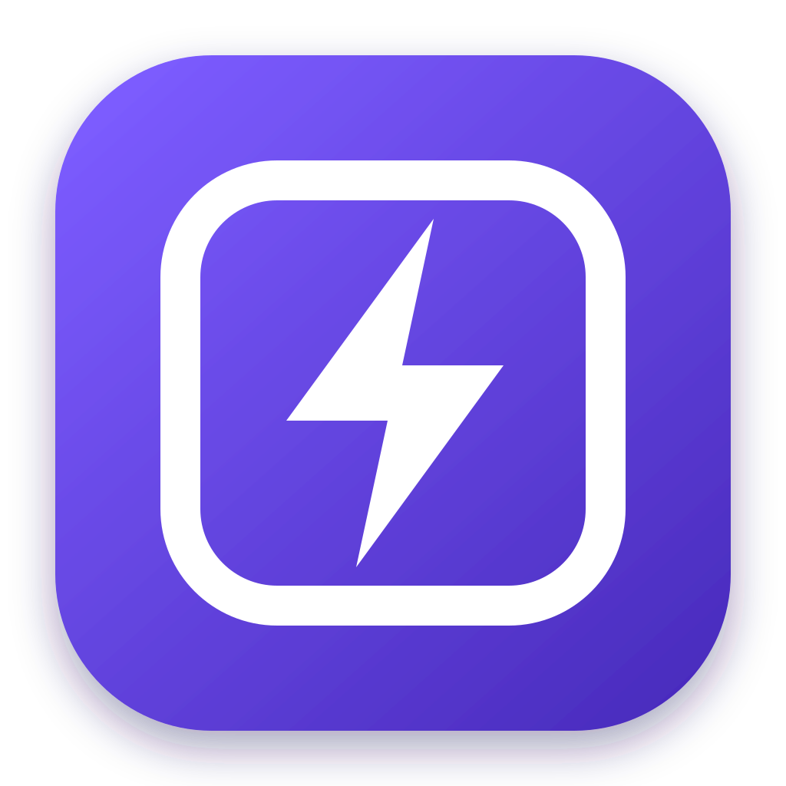

<p align="center">
  
</p>

<h1 align="center">Delight</h1>

<p align="center">
  A keyboard launcher for macOS where every tool is a plugin.
  Paste JSON, a JWT or a host name, and the tool that fits opens.
</p>

<p align="center">
  <a href="https://github.com/brijsiyag/delight/releases/latest"></a>
  
  <a href="LICENSE"></a>
</p>

<p align="center">
  <a href="#install">Install</a> ·
  <a href="#built-in-tools">Built-in tools</a> ·
  <a href="docs/plugins/README.md">Plugin guide</a> ·
  <a href="CONTRIBUTING.md">Contributing</a>
</p>

> [!WARNING]
> **Delight is in alpha.** The plugin API may change often, and plugins may break with a new
> release until they are rebuilt.

Press **⌘⇧Space** and type or paste anything. Delight asks every plugin whether it can help,
lists the tools that fit, best first, and opens the best one before you choose. Every tool, the
built-in ones too, is a plugin: one `.wasm` file that draws its own interface and can do only what
you allowed it to.

## Features

- **Tools find you.** Each plugin looks at your input and says how well its tools fit it; the
  best one is already open.
- **Keyboard first.** ⌘1–⌘9 picks a tool, and every tool's actions use the same keys (↵, ⌘↵,
  ⌥1–⌥9), shown in the footer.
- **Remembers what was worth it.** Tools save the inputs that found something: Tab completes
  them, ⌃R searches them.
- **Plugins are single files, sandboxed.** A plugin sees its own data folder and nothing else.
  The network and running programs need a permission it declares with its reason, which you see
  before you install it.
- **Updates itself:** the app and each plugin, every download checked before anything runs.
- **Native.** Built with [GPUI](https://github.com/zed-industries/zed/tree/gpui-multi-root-embedded-rebased/crates/gpui), Zed's
  GPU-accelerated UI framework and [embedded GPUI](https://github.com/zed-industries/embedded_gpui/tree/surfaces-as-roots)

## Install

Download and install `Delight-X.Y.Z.dmg` from the [latest release](https://github.com/brijsiyag/delight/releases/latest) 

Delight lives in the menu bar. Default shortcut **⌘⇧Space** shows and hides it; change the shortcut in
Settings → General.

## Built-in tools

| Plugin | Tool | Paste or type | What you get |
|---|---|---|---|
| **Formats** | JSON | JSON | Formatted, minified, escaped or unescaped; keys sorted if you like; 2 or 4 spaces |
| | YAML ⇄ JSON | YAML, or JSON | The other one |
| | Base64 | any text, or Base64 | Encoded or decoded, URL-safe too |
| | .env ⇄ JSON | a `.env` file, or a JSON object | The other one |
| | JWT | a token | Its header and claims, dates in your time zone; type the secret to verify the signature |
| | JSON → JWT | a JSON object | A token signed with your secret (HS256, HS384, HS512) |
| **Network** | DNS lookup | a host name, URL or IP address | Its records, which resolver answered (your VPN's included), what apps get, reverse lookups |
| **Graphics** | SVG Preview | SVG code | The image on a checkerboard, light or dark; copy it as a data URI |

## Installing plugins

In Settings, click **Install Plugin** under the list of plugins to pick a `.wasm` file, or use
the arrow beside it for **From a Link…** to install from where plugins are published. Dropping a
`.wasm` file on the menu bar icon works too. Before anything of the plugin runs, Delight shows who
made it, its tools and the permissions it asks for, each with its reason. A plugin that says where
it is published is kept up to date; each plugin's page has *Update automatically* to turn that
off.

## Writing a plugin

A plugin is a small Rust crate built for WebAssembly. It tells Delight which inputs its tools fit,
and draws them with GPUI:

```rust
#[plugin(id = "dev.example.case", name = "Case", icon = "assets/icon.svg")]
struct Case;

impl Plugin for Case {
    type Operation = CaseOperation;

    fn detect(&mut self, input: &Input, _: &mut App) -> Vec<Detection<CaseOperation>> {
        if input.text.starts_with("case ") { vec![Detection::new(CaseOperation::ChangeCase, 0.95)] } else { vec![] }
    }

    // `new` builds the plugin, and `open_tool` returns a GPUI view with its footer actions.
}
```

The [plugin guide](docs/plugins/README.md) takes you from an empty folder to an installed plugin,
then covers drawing, the host API, permissions, settings, testing and publishing.

## How it works

```text
Delight.app (native GPUI)
 ├─ launcher: input → detection → tool list → the tool → footer actions
 ├─ settings window
 └─ one sandboxed WebAssembly instance per plugin (wasmtime)
        ▲  a small object protocol
        ▼
plugin.wasm: its own GPUI, drawn into a surface the launcher shows using embedded_gpui
```

The app knows nothing about JSON or DNS. It owns the window, the input, the tool list, the footer,
settings, history and updates, and **tools draw all of their own UI**. A plugin is a WebAssembly
component that runs its own GPUI through [embedded GPUI](https://github.com/zed-industries/embedded_gpui/tree/surfaces-as-roots).
What it is (its name, icon, tools and permissions) is written into the `.wasm`, so Delight reads it
without running any of its code. [How a plugin runs](docs/plugins/concepts.md) has the details.

**For now, a fork.** A few things Delight needs aren't in upstream embedded_gpui yet, so Delight
builds on its own fork, [brijsiyag/embedded_gpui](https://github.com/brijsiyag/embedded_gpui/tree/delight)
(branch `delight`): upstream's `surfaces-as-roots`, plus hiding a plugin's surface and caching
compiled plugins. Both are proposed upstream, and as soon as upstream releases them, Delight moves
back to it.

## Where Delight keeps things

| What | Where |
|---|---|
| Settings, installed plugins, input history, each plugin's data | `~/Library/Application Support/Delight` |
| Plugins' secrets | in the same folder, encrypted with a key kept in your login Keychain |
| Compiled plugins | `~/Library/Caches/Delight` |
| Logs (*Open Logs* in the menu bar) | `~/Library/Logs/Delight` |

## Troubleshooting

- **A tool says its plugin stopped.** The plugin crashed or took too long, and the other plugins
  carry on. It stays off until Delight starts again (*Quit Delight* in the menu bar, then open
  it); *Open Logs* shows why it stopped.
- **A plugin won't load.** Settings lists it with a warning sign; its page says why, and *Copy
  Details* copies all of it. A plugin built for a newer Delight needs Delight updated; one built
  for an older plugin API needs rebuilding by its author.
- **The shortcut does nothing.** Another app may have taken it: record another in
  Settings → General.

## License

MIT. Icons from [Lucide](https://lucide.dev) (ISC); the launcher's input font is
[Lilex](https://github.com/mishamyrt/Lilex) (SIL Open Font License).
